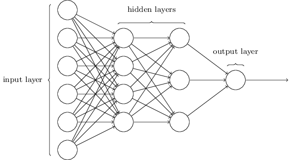

# Using neural nets to recognize handwritten digits
object: write a computer program implementing a neural network that learns to recognize handwritten digits.

## Perceptrons
- A perceptron takes several $\textbf{binary}$ inputs $ x_1,x_2,...$ and produces a single $\textbf{binary}$ output:

In the example shown a perceptron has three $inputs$, $x_1, x_2, x_3$.
- $weights$ are real numbers expressing the importance of the respective inputs to the output.
- The neuron's $output$, 0 or 1, is determined by whether the weighted sum $\sum_jw_jx_j$  is less than or greater than some threshold value.

$$output=
\tag{1}
\begin{cases}
0 &  if & \sum_jw_jx_j \leq threshold\\ 
1 &  if & \sum_jw_jx_j > threshold
\end{cases}$$

$\textbf{intuition:}$ perceptron is a device that makes decisions by weighing up evidence.

simplified perceptrons
- $w \cdot x \equiv  \sum_jw_jx_j$
- $ b \equiv - threshold $  (perceptron's $bias$: a measure of how easy it is to get the perceptron to output 1)
$$output=
\tag{2}
\begin{cases}
0 &  if & w \cdot x + b \leq 0\\ 
1 &  if & w \cdot x + b > 0
\end{cases}$$

## Sigmoid neurons
$\textbf{intuition:}$ a small change in a weight (or bias) causes only a small change in output.
- sigmoid neuron has $inputs$, $x_1,x_2,...$ these inputs can take on $\textbf{any}$ values $between$ 0 and 1.
- the sigmoid neuron has $weights$ for each input,$w_1,w_2,...$,  and an overall $bias$, $b$.
- $output$ is $\sigma(w \cdot x + b)$, where $\sigma$ is called the sigmoid function[^1], defined by:
$$
\tag{3}
\sigma(z) \equiv \frac{1}{1 + e^{-z}}
$$
[^1]:$\sigma$ is sometimes called the logistic function, and this new class of neurons called logistic neurons.

By using the actual $\sigma$ function we get a $\textbf{smoothed}$ out perceptron. The smoothness of $\sigma$ means that small changes $\Delta w_j$ in the weights and $\Delta b$ in the bias will produce a small change $\Delta \text{output}$ in the output from the neuron.
$$
\tag{4}
\Delta \text{output} = \sum_j{ \frac{\partial \text{ output}}{\partial w_j} \Delta w_j + \frac{\partial \text{ output}}{\partial b} \Delta b} 
$$
$\textbf{intuition:}$ $\Delta \text{output}$ is a linear function of the changes $\Delta w_j$ and $\Delta b$ in the $weights$ and $bias$. This linearity makes it easy to choose small changes in the weights and biases to achieve any desired small change in the output. 
### Further discussion
- activation function: it's the $\textbf{shape}$ of $\sigma$ which really matters, and not its exact form. However, when we compute those partial derivatives in $(4)$, using $\sigma$ will simplify the algebra. In any case, $\sigma$ is commonly-used in work on neural nets, and is the activation function we'll use most often.

## The architecture of neural networks
- The leftmost layer in this network is called the input layer, and the neurons within the layer are called input neurons. 
- The rightmost or output layer contains the output neurons, or, as in this case, a single output neuron. 
- The middle layer is called a $hidden$ $layer$, since the neurons in this layer are neither inputs nor outputs.

- The design of the input and output layers in a network is often straightforward.
-  neural networks researchers have developed many design heuristics for the $hidden$ $layers$, which help people get the behaviour they want out of their nets. For example, such heuristics can be used to help determine how to trade off the number of hidden layers against the time required to train the network.
- $feedforward$ neural networks: neural networks where the output from one layer is used as input to the next layer.
## A simple network to classify handwritten digits
split the problem of recognizing handwritten digits into two sub-problems:
- ($segmentation$ $problem$)：breaking an image containing many digits into a sequence of separate images, each containing a single digit.
- classifying individual digits 
To recognize individual digits we will use a three-layer neural network:
