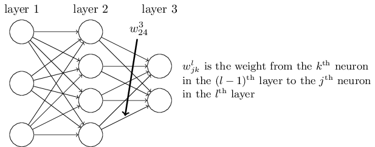
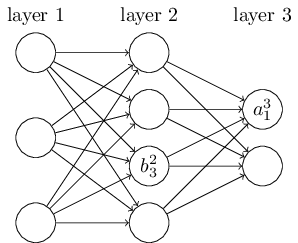

# How the backpropagation algorithm works
## a fast matrix-based approach to computing the output from a neural network
- use $w_{jk}^l$ to denote the weight for the connection from the $k^{th}$ neuron in the $(l - 1)^{th}$ layer to the $j^{th}$ neuron in the $l^{th}$ layer.

- use $b_j^l$ for the bias of the $j^{th}$ neuron in the $l^{th}$ layer. 
- use $a_j^l$ for the activation of the $j^{th}$ neuron in the $l^{th}$ layer. 

then we have:
$$
a_j^l = \sigma \left(\sum_k{w^l_{jk}a_k^{(l-1)} + b_j^l} \right)
 \tag{1}
$$

$(1)$ can be rewritten in the beautiful and compact vectorized form:
$$
a^l = \sigma(w^la^{l-1} + b^l)
\tag{2}
$$

- to compute $a^l$, we need compute the intermediate quantity $z^l = w^la^{l-1} + b^l$. We call $z^l$ the $weighted$ $input$ to the neurons in layer $l$.

## The two assumptions we need about the cost function
the quadratic cost has the form
$$
C = \frac{1}{2n}\sum_x{||y(x)-a^L(x)||^2}
$$
For backpropagation to work we need to make two main assumptions about the form of the cost function. 
- The first assumption we need is that the cost function can be written as an average $C= \frac{1}{n}\sum_x C_x$ over cost functions $C_x$,for individual training examples, $x$.
The reason we need this assumption is because what backpropagation actually lets us do is compute the partial derivatives $\frac{\partial C_x}{\partial w}$ and $\frac{\partial C_x}{\partial b}$ for a single training example. We then recover $\frac{\partial C_x}{\partial w}$ and $\frac{\partial C_x}{\partial b}$ by averaging over training examples. 
- The second assumption we make about the cost is that it can be written as a function of the outputs from the neural network. For example, the quadratic cost function satisfies this requirement.